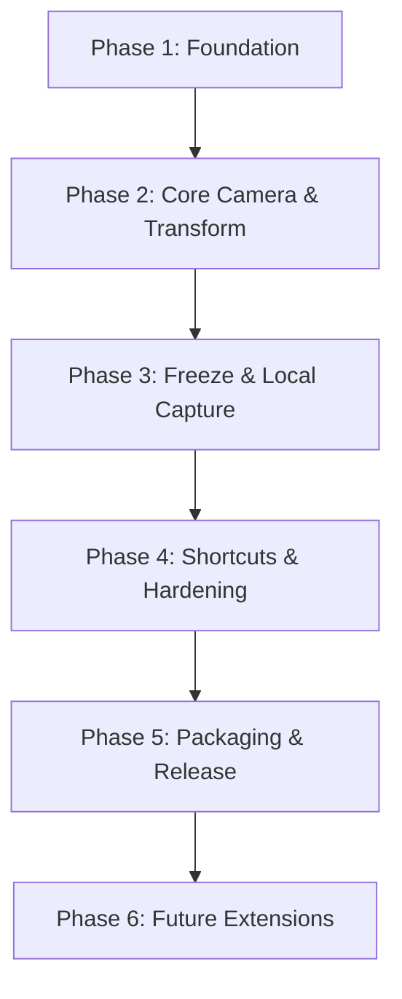

# WebcamViewer Development Roadmap (로드맵)

본 문서는 `prd.md` 및 `shrimp-rules.md`에 기초하여 로컬 실물화상기 앱(WebcamViewer)의 개발 일정, 단계별 마일스톤, 그리고 향후 확장 계획을 정의합니다.

---

## 1. 개발 마일스톤 및 아키텍처 개요

전체 개발 흐름은 **"구조 먼저 → 공통기능 → 개별기능"**의 원칙을 엄격하게 따릅니다. 1차 목표는 완벽하게 격리된 로컬 환경에서 안정적으로 동작하는 데스크톱 MVP 버전을 구축하는 것입니다.

---

## 2. 세부 개발 단계 (Milestones)

### Phase 1: Foundation (기반 다지기) ✅ 완료
- **상태**: 100% 완료
- **목표**: Electron + Vite + React + TS + TailwindCSS 개발 환경 완비 및 기본 UI 뼈대 구축.
- **주요 작업**:
  - `package.json`, `vite.config.ts`, `tsconfig.json` 설정 완료.
  - Electron Main 프로세스 및 Preload 브릿지 선언 완료.
  - 다크 테마 기반의 반응형 레이아웃 마크업 (상단 상태 바, 메인 뷰어 영역, 하단 툴바) 완료.
  - UI 공통 버튼 컴포넌트(`IconButton`) 및 에러/로딩/빈 상태 UI 구축 완료.
- **결과물**: "개발 서버 실행 시 기본 UI 프레임이 나타나는 데스크톱 창 구동".

### Phase 2: Core Camera & View Transform (카메라 연동 및 조작) ✅ 완료
- **상태**: 100% 완료
- **목표**: 웹캠 장치 검색, 라이브 비디오 스트리밍, 그리고 CSS 기반의 실시간 화면 조작 구현.
- **주요 작업**:
  - `useCamera` 훅 구현: `navigator.mediaDevices`를 활용하여 디바이스 나열 및 카메라 전환 지원 완료.
  - `CameraSelector` 드롭다운 컴포넌트 연동 완료.
  - **카메라 생명주기 관리**: 카메라 중지 및 장치 전환 시 기존 `MediaStreamTrack`을 명시적으로 `.stop()` 처리하는 메모리 누수 방지 유틸 적용 완료.
  - `useViewerTransform` 훅 구현: 좌우반전(`scaleX(-1)`), 90도 회전(`rotate`), 확대/축소(`scale`) CSS transform 값 매핑 완료.
  - `useFullscreen` 훅 구현: HTML5 Fullscreen API 연동 및 상태 감지 완료.
- **결과물**: "연결된 카메라 목록을 선택해 화면에 띄우고, 마우스 클릭으로 회전/반전/확대할 수 있는 라이브 뷰어".

### Phase 3: Freeze & Local Capture (화면 정지 및 고해상도 저장) ✅ 완료
- **상태**: 100% 완료
- **목표**: 비디오 일시 정지(Freeze) 기능 및 변환 매트릭스가 반영된 고해상도 로컬 이미지 캡처/저장.
- **주요 작업**:
  - **화면 정지**: 현재 `<video>` 프레임을 canvas에 순간 캡처하여 데이터 URL화하고, `` 요소로 전환하여 정지 구현 완료.
  - **Canvas 이미지 렌더링**: CSS 변환 상태(회전, 반전, 확대)와 1:1 대응되는 좌표 매핑을 적용하여 오프스크린 Canvas에 현재 프레임을 그리는 헬퍼(`canvas.ts`) 구현 완료.
  - **로컬 디스크 저장**: Preload 브릿지의 `window.electronAPI.saveCapture`를 통해 바이너리를 Main 프로세스로 전달, Main에서 Node.js `fs`를 이용해 `webcam-capture-YYYY-MM-DD-HHMMSS.png` 형태로 로컬 Pictures/WebcamViewer 폴더에 저장 완료.
- **결과물**: "원터치 화면 정지/해제 및 회전/반전/배율이 정확히 보정된 스크린샷 로컬 저장 기능".

### Phase 4: Keyboard Shortcuts & Hardening (단축키 및 안정화) ✅ 완료
- **상태**: 100% 완료
- **목표**: 전체화면 포함 환경에서의 전역 단축키 수신 및 예외 처리 강화.
- **주요 작업**:
  - `useKeyboardShortcuts` 훅 구현: `document` 레벨에서 캡처 단계(`useCapture: true`) 리스너를 바인딩하여 포커스가 없거나 전체화면이어도 단축키(`Space`, `F`, `M`, `R`, `+`, `-`, `0`, `C`, `Esc`)가 동작하도록 처리 완료.
  - 장치 점유 상태 예외, 권한 거부 예외, 저장 실패 예외 대응 UI 알림 및 커스텀 토스트 연동 완료.
- **결과물**: "실수 없는 키보드 핫키 처리 및 비정상 하드웨어 상태 예외에 강한 완성도 높은 클라이언트".

### Phase 5: Packaging & Release (패키징 및 배포) ⏳ 대기 중
- **상태**: 대기 중
- **목표**: Windows 실행 파일(`.exe`) 패키징 검증 및 가이드 작성.
- **주요 작업**:
  - `electron-builder` 구성 (아이콘, 파일 쓰기 권한 정의 등).
  - 로컬 Windows 환경 배포판(`.exe`) 빌드 테스트.
  - `README.md`에 설치, 실행, 빌드 방법, 단축키 표 및 테스트 가이드 상세화.
- **결과물**: "인터넷 없이도 설치하고 바로 실행할 수 있는 무설치형 포터블 `.exe` 파일".

---

## 3. 향후 확장 로드맵 (Post-MVP)

MVP 버전이 완전하게 검증된 이후, 다음과 같은 고부가가치 기능을 추가 확장할 수 있도록 설계를 유연하게 유지합니다.

1. **Phase 6: 화면 판서 및 주석 (Overlay Annotation)**
   - 비디오 위에 그리는 펜, 형광펜, 지우개, 간단한 도형(원, 사각형, 화살표) 툴바 추가.
   - 판서 상태를 포함하여 캡처 이미지로 저장할 수 있는 기능 연동.
2. **Phase 7: 영상 보정 필터 (Image Adjustments)**
   - 대비(Contrast), 밝기(Brightness), 흑백 반전(전자칠판용 서류 모드) 필터 제공.
3. **Phase 8: 사용자 환경 설정 보존 (Settings Persistence)**
   - 마지막에 사용했던 카메라 디바이스 ID, 사용자 정의 캡처 폴더 경로 등을 로컬 파일(`config.json`) 형태로 기억/복원.
