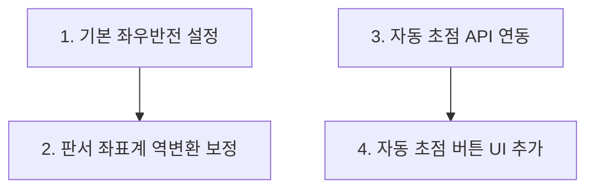

# WebcamViewer 신규 요구사항 구현 로드맵 (roadmap2.md)

이 로드맵은 실물화상기 요구사항(기본 좌우반전 설정, 회전/반전에 대응하는 판서 좌표 보정, 자동초점 지원)을 성공적으로 구현하기 위한 단계별 작업 계획을 수립합니다.

## 1. 개요 및 최종 목표
* **목표 1**: 실물화상기 특성에 맞춰 앱 구동 시 화면을 기본적으로 180도 회전된 상태(`rotation = 180`)로 시작.
* **목표 2**: 화면이 대칭, 회전, 확대된 상태에서도 마우스 포인터 위치에 정확히 판서 선이 일치되도록 캔버스 좌표 역변환 연산식 적용.
* **목표 3**: 하단 툴바에 자동초점(Refocus) 버튼을 추가하고, WebRTC MediaStreamTrack Constraints API를 이용해 카메라 렌즈의 오토포커싱 동작 제어.

---

## 2. 태스크 리스트 및 구현 세부사항

### 태스크 1: 기본 180도 회전 설정
* **설명**: 앱 실행 및 변형 초기화 시 기본 180도 회전 상태 활성화.
* **수정 파일**:
  * [src/hooks/useViewerTransform.ts](file:///d:/codes/WebcamViewer/src/hooks/useViewerTransform.ts)
* **내용**:
  * `rotation` 상태의 초기값(`useState`)을 `180`으로 설정하고 `isFlipped`는 `false`로 설정.
  * `resetTransform` 콜백 내에서 `setRotation(180)`, `setIsFlipped(false)`로 리셋 설정.
* **인수 조건**: 앱 시작 시 또는 초기화 단축키(0) 입력 시 화면이 180도 회전된 상태로 기동함.

### 태스크 2: 회전 및 대칭에 대응하는 판서(Canvas) 좌표 보정
* **설명**: 화면 변형(zoom, rotation, flip) 시 드로잉 마스크와 마우스 포인터 정렬.
* **수정 파일**:
  * [src/components/AnnotationCanvas.tsx](file:///d:/codes/WebcamViewer/src/components/AnnotationCanvas.tsx)
  * [src/components/CameraViewer.tsx](file:///d:/codes/WebcamViewer/src/components/CameraViewer.tsx)
* **내용**:
  * `AnnotationCanvas` 컴포넌트의 인터페이스에 `zoom`, `rotation`, `isFlipped` 프로프 주입.
  * `getCanvasCoords` 내에서 스크린 좌표에 대해 캔버스 CSS transform 역행렬 연산(역회전 -> 역대칭 -> 역줌)을 수학적으로 수행.
  * `canvas.clientWidth` 및 `canvas.clientHeight` 레이아웃 영역 비율을 기준하여 실제 캔버스 내부 해상도로 스케일 복원.
* **인수 조건**: 90도/180도/270도 회전, 좌우반전, 확대 상태에서도 펜/형광펜/지우개/도형 그리기가 커서 위치에 정확하게 그려짐.

### 태스크 3: 웹캠 비디오 트랙 초점 고정(Focus Lock) API 연동
* **설명**: WebRTC `applyConstraints` 인터페이스 제어 및 초점 고정/자동 제어.
* **수정 파일**:
  * [src/hooks/useCamera.ts](file:///d:/codes/WebcamViewer/src/hooks/useCamera.ts)
* **내용**:
  * `isAutoFocusSupported` 상태(초점 모드 제어 기능 지원 유무, manual/continuous 둘 다 가능한지 확인) 및 `isFocusLocked` 상태, `toggleFocusLock` 메서드 신설.
  * `toggleFocusLock` 호출 시 현재 락(lock) 상태를 반전하여 `true`라면 `focusMode: 'manual'`(초점 고정), `false`라면 `focusMode: 'continuous'`(자동 초점 활성화)를 적용함.
* **인수 조건**: 자동 초점 및 수동 제어를 지원하는 장치 감지 시 `isAutoFocusSupported`가 true가 되며 초점 상태 토글이 성공함.

### 태스크 4: 툴바 초점 고정 버튼 UI 추가
* **설명**: 하단 툴바에 Lock/Unlock 아이콘 추가 및 상태 연동.
* **수정 파일**:
  * [src/components/Toolbar.tsx](file:///d:/codes/WebcamViewer/src/components/Toolbar.tsx)
  * [src/App.tsx](file:///d:/codes/WebcamViewer/src/App.tsx)
* **내용**:
  * `Toolbar.tsx`에 `Lock`, `Unlock` 아이콘 단추를 추가하고 `isAutoFocusSupported` 값에 따라 노출 제어. `active` 상태는 `isFocusLocked`와 연동.
  * `App.tsx`에서 `useCamera`의 `toggleFocusLock` 및 `isFocusLocked` 상태를 `Toolbar`와 매핑.
* **인수 조건**: 하단바 좌측에 초점 고정 버튼이 노출되며, 클릭 시 초점이 잠기거나(Lock) 풀려 자동초점(Unlock) 상태로 전환됨.

---

## 3. 의존성 및 우선순위 그래프

